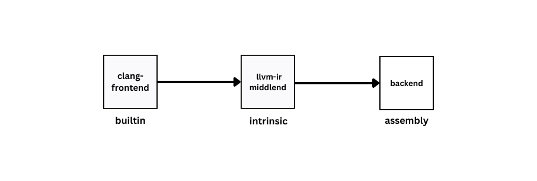
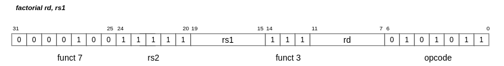
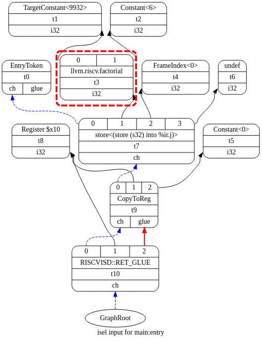
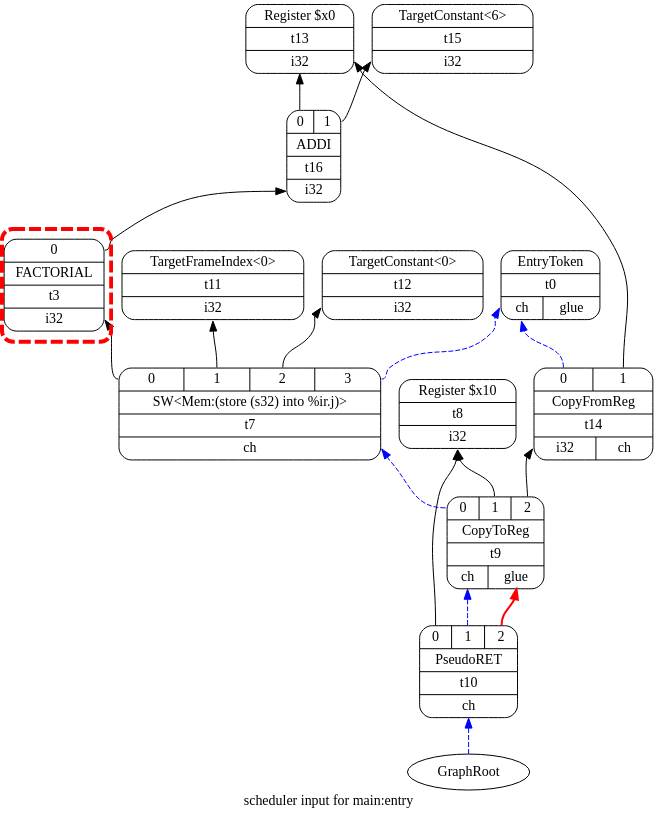
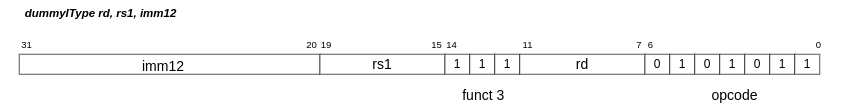

# Tutorial - Adding a dummy Intrinsic in LLVM for RISCV

This tutorial shows the easiest way to add a clang builtin, which is then mapped onto an intrinsic in the middle end, and ultimately a RISCV instruction in the backend.



## Step 0 - Requirements

Before starting with the tutorial, ensure that you have the following:

- A basic understanding of LLVM infrastructure and its Intermediate Representation (IR).
- A C++ development environment set up to build LLVM.
- Familiarity with the RISC-V instruction set architecture (ISA) and its assembly language.
- Familiarity with TableGen.

## Step 1 - Downloading riscv-gnu-toolchain for llvm
Download the 32-bit version for llvm from [riscv-gnu-toolchain](https://github.com/riscv-collab/riscv-gnu-toolchain/releases/tag/2024.04.12). Direct link of toolchain that that was used to make this tutorial is [this](https://github.com/riscv-collab/riscv-gnu-toolchain/releases/download/2024.08.06/riscv32-elf-ubuntu-22.04-llvm-nightly-2024.08.06-nightly.tar.gz).

## Step 2 - Cloning llvm-project
```
git clone https://github.com/llvm/llvm-project.git riscv-llvm
```

## Step 3 - Building llvm-project
```
cd riscv-llvm

mkdir build

cd build

# Change path_to_riscv-gnu-toolchain here
cmake -G Ninja -DCMAKE_BUILD_TYPE="Debug" -DBUILD_SHARED_LIBS=True \
 -DLLVM_USE_SPLIT_DWARF=True \
 -DCMAKE_INSTALL_PREFIX="<path_to_riscv_gnu_toolchain>" \
 -DLLVM_OPTIMIZED_TABLEGEN=True \
 -DLLVM_BUILD_TESTS=False \
 -DLLVM_DEFAULT_TARGET_TRIPLE="riscv32-unknown-elf" \ 
 -DLLVM_TARGETS_TO_BUILD="RISCV" \
 -DLLVM_ENABLE_PROJECTS="clang" ../llvm

cmake --build . --target install
```

## Step 4 - Adding builtin in Clang
Here we are going to add a dummy `factorial` builtin that receives one integer as an argument and returns the factorial of that integer. The type of input argument is `unsigned int` and the type of output argument is `unsigned int`.
- Open `riscv-llvm/clang/include/clang/Basic/BuiltinsRISCV.td`
- Add the following code:
```
def factorial : RISCVBuiltin<"unsigned int(unsigned int)">;
```
- The above code creates a `RISCVBuiltin` with the argument `unsigned int` and return type `unsigned int`.

## Step 5 - Adding intrinsic definiton in middle-end
- Open `riscv-llvm/llvm/include/llvm/IR/IntrinsicsRISCV.td`
- Add the following code:
```
let TargetPrefix = "riscv" in {

  class RiscvFactorial
      : Intrinsic<[llvm_i32_ty], [llvm_i32_ty],
              [IntrNoMem, IntrWillReturn, IntrSpeculatable]>;
  
  def int_riscv_factorial : RiscvFactorial;
}
```
- The above code creates a class `RISCVFactorial` which inherits from `Intrinsic`.
- The first argument to `Intrinsic` is `llvm_i32_ty` which corresponds to the builtin return type defined in Step 4.
- The second argument to `Intrinsic` is `llvm_i32_ty` which corresponds to the builtin parameter defined in Step 4.
- `IntrNoMem` is an intrinsic property that states instruction does not access memory.
- `IntrWillReturn` is an intrinsic property that states that instruction will return.
- `IntrSpeculatable` is an intrinsic property that indicates that the intrinsic is safe to speculate.
- `def` is used to instantiate a record of the class `RISCVFactorial`.
- You can find the definition of `Intrinsic` class in `llvm/include/llvm/IR/Intrinsics.td`.

## Step 6 - Mapping the builtin to the intrinsic
- Open `riscv-llvm/clang/lib/CodeGen/CGBuiltin.cpp`
- In the function `EmitRISCVBuiltinExpr`, in the `switch(BuiltID)` statement add:
```
case RISCV::BI__builtin_riscv_factorial:
    ID = Intrinsic::riscv_factorial;
    break;
```

## Step 7 - Adding the factorial instruction to which the builtin will be mapped

<i><b>Instruction encoding</b></i>



- Move to the directory `riscv-llvm/llvm/lib/Target/RISCV`
- Create a file named `RISCVInstrInfoFactorial.td`
- Add the following code:
```
def FACTORIAL : Instruction {
    bits<32> Inst;
    bits<32> SoftFail = 0;
    bits<5> rs2 = 0b11111;
    bits<5> rs1;
    bits<5> rd;
    let Namespace = "RISCV";
    let Size = 4;
    let hasSideEffects = 0;
    let mayLoad = 0;
    let mayStore = 0;
    let Inst{31-25} = 0b0000100; /*funct7*/  
    let Inst{24-20} = rs2;
    let Inst{19-15} = rs1;
    let Inst{14-12} = 0b111; /*funct3*/
    let Inst{11-7} = rd;
    let Inst{6-0} = 0b0101011; /*opcode*/
    dag OutOperandList = (outs GPR:$rd);
    dag InOperandList = (ins GPR:$rs1);
    let AsmString = "factorial\t$rd, $rs1";
}
```
- The above code creates a `FACTORIAL` instruction.
- The instruction is 32-bits long.
- `Softfail` is a field that the disassembler can use to provide a way for instructions to not match without killing the whole decode process.
- `rs2` is source register 2, it is fixed here because our `factorial` instruction requires only one source register.
- `rs1` is source register 1.
- `rd` is the destination register.
- `hasSideEffects` indicates that the instruction has side effects that are not captured by any operands of the instruction or other flags.
- `mayLoad` and `mayStore` tell whether instruction reads or writes to memory, respectively.
- `OutOperandList` is a dag that references the destination register.
- `InOperandList` is a dag that references the source registers.
- You can find the definition of `Instruction`, `ins` and `outs` in `llvm/include/llvm/Target/Target.td`
- Next, add the pattern to match in the same file:
```
def : Pat<(int_riscv_factorial GPR:$rs1), (FACTORIAL GPR:$rs1)>;
```
- This line matches the intrinsic to the `FACTORIAL` instruction.
- `Pat` takes two arguments, `dag from` and `dag to`.
- <b>Note:</b> Here we do not create our own class for an instruction because we are only adding one instruction. If multiple similar instructions have to be added then we can create a class that inherits from `Instruction` and reduce the code duplication. You can look at files [RISCVInstrInfo.td](https://github.com/llvm/llvm-project/blob/main/llvm/lib/Target/RISCV/RISCVInstrInfo.td) and [RISCVInstrFormats.td](https://github.com/llvm/llvm-project/blob/main/llvm/lib/Target/RISCV/RISCVInstrFormats.td) to see how the code duplication for instructions with similar formats is dealt with by using inheritance.

## Step 8 - Include `RISCVInstrInfoFactorial.td`
- Open `llvm/lib/Target/RISCV/RISCVInstrInfo.td`
- Add the following include:
```
include "RISCVInstrInfoFactorial.td"
```

## Step 9 - Rebuild llvm-project
- Move to `build` directory and run:
```
cmake --build . --target install
```

## Step 10 - Testing
- Create a `main.c` file with the following code:
```
int main() {
	unsigned int j = __builtin_riscv_factorial(6);
}
```
- Generate LLVM IR using:
```
clang -S -emit-llvm main.c -o main.ll
```
### Generating DAG
LLVM-IR instructions are converted into Direct Acyclic Graph. This process converts each basic block in the IR to a separate DAG and each instruction in that DAG is converted into a SelectionDAGNode (SDNode). These nodes go through the lowering,
DAG combiner, and legalization phases, making it easier to match against the target
instructions. The instruction selection then performs a DAG-to-DAG conversion
using node pattern matching and transforms the SelectionDAG nodes into nodes
representing target instructions.

- DAG, before instruction selection, generated using:
    ```
    # -fast-isel option is set to false here because llc by default uses FastIsel at no optimization

    llc -view-isel-dags -fast-isel=false main.ll

    # generate svg from dot file
    
    dot -Tsvg <path_to_dot_file> -o dag.svg  
    ```
    
    

- DAG, after instruction selection, generated using:
    ```
    # -fast-isel option is set to false here because llc by default uses FastIsel at no optimization

    llc -view-sched-dags -fast-isel=false main.ll
    
    # generate svg from dot file
    
    dot -Tsvg <path_to_dot_file> -o dag.svg 
    ```

    

- Compile using the command
```
clang main.c
```
- Get the objdump
```
llvm-objdump -d a.out > a.dump
```
- In `a.dump` file you can see `factorial` instruction in the `main` function:
```
00010162 <main>:
   10162: 1141         	addi	sp, sp, -0x10
   10164: c606         	sw	ra, 0xc(sp)
   10166: c422         	sw	s0, 0x8(sp)
   10168: 0800         	addi	s0, sp, 0x10
   1016a: 4519         	li	a0, 0x6
   1016c: 09f5752b     	factorial	a0, a0
   10170: fea42a23     	sw	a0, -0xc(s0)
   10174: 4501         	li	a0, 0x0
   10176: 40b2         	lw	ra, 0xc(sp)
   10178: 4422         	lw	s0, 0x8(sp)
   1017a: 0141         	addi	sp, sp, 0x10
   1017c: 8082         	ret
```


# Additional Example: Adding an I-type Instruction
The process for adding an I-type instruction is same as the above. The code snippets are given below.

- Open `riscv-llvm/clang/include/clang/Basic/BuiltinsRISCV.td`
- Add the following code:
```
def dummy_IType : RISCVBuiltin<"int(int,int)">
```
- Open `riscv-llvm/llvm/include/llvm/IR/IntrinsicsRISCV.td`
- Add the following code:
```
let TargetPrefix = "riscv" in {

  class RiscvDummyIType
      : Intrinsic<[llvm_i32_ty], [llvm_i32_ty, llvm_i32_ty],
              [IntrNoMem, IntrWillReturn, IntrSpeculatable]>;
  
  def int_riscv_dummy_IType : RiscvDummyIType;
}
```
An additional step to check if the immediate operand provided can be represented in 12-bits is to have a check in `clang/lib/Sema/SemaRISCV.cpp` in the function `CheckBuiltinFunctionCall`. This will makes sure that the immediate operand is within the range -2048 to 2047. If not then the `clang` semantic checker would throw a diagnostic error.
```

case RISCV::BI_builtin_riscv_dummy_IType:
    return SemaRef.BuiltinConstantArgRange(TheCall, 1, -2048, 2047);
```
- Open `riscv-llvm/clang/lib/CodeGen/CGBuiltin.cpp`
- In the function `EmitRISCVBuiltinExpr`, in the `switch(BuiltID)` statement add:
```
case RISCV::BI__builtin_riscv_dummy_IType:
    ID = Intrinsic::riscv_dummy_IType;
    break;
```
<i><b>Instruction encoding</b></i>



- Move to the directory `riscv-llvm/llvm/lib/Target/RISCV`
- Create a file named `RISCVInstrInfoFactorial.td`
- Add the following code:
```
def DUMMYITYPE : Instruction {
    bits<32> Inst;
    bits<32> SoftFail = 0;
    bits<5> rs1;
    bits<5> rd;
    bits<12> imm12;
    let Namespace = "RISCV";
    let Size = 4;
    let hasSideEffects = 0;
    let mayLoad = 0;
    let mayStore = 0;
    let Inst{31-20} = imm12;
    let Inst{19-15} = rs1;
    let Inst{14-12} = 0b111; /*funct3*/
    let Inst{11-7} = rd;
    let Inst{6-0} = 0b0101011; /*opcode*/
    dag OutOperandList = (outs GPR:$rd);
    dag InOperandList = (ins GPR:$rs1, simm12:$imm12);
    let AsmString = "dummyIType\t$rd, $rs1, $imm12";
}
```
```
def : Pat<(int_riscv_dummy_IType GPR:$rs1, simm12:$imm12), (DUMMYITYPE GPR:$rs1, simm12:$imm12)>;
```
You can repeat the steps 9 and 10 for `dummyIType`. In the testing, just change the name to the respective builtin and pass two arguments, one for `rs1` and other for `imm12`.